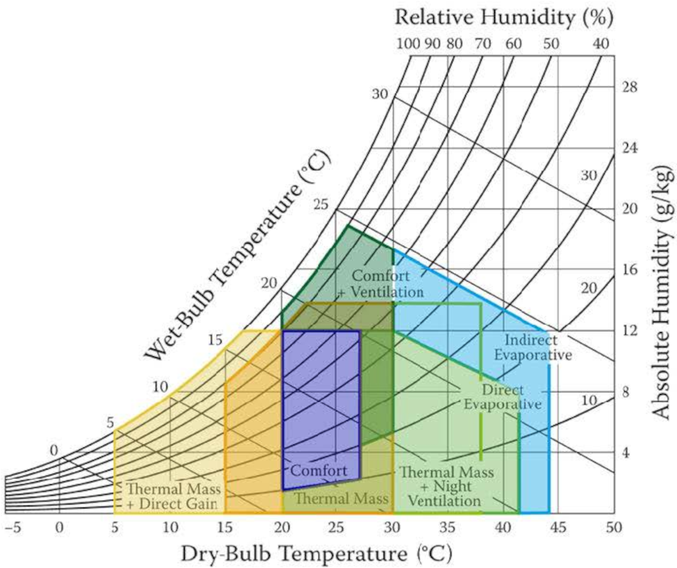
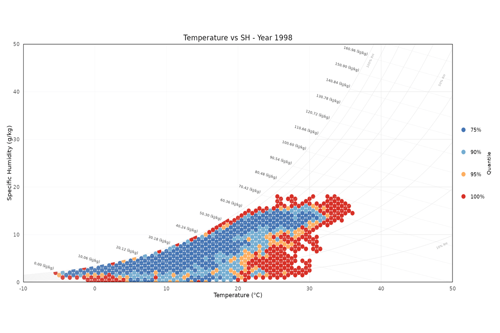

# PsyChroMAP: Psychrometric Map Visual Explorer

<!-- badges: start -->
[](https://www.gnu.org/licenses/gpl-3.0)
[](https://doi.org/10.5281/zenodo.17794151)
<!-- badges: end -->

## Overview

PsyChroMAP provides efficient R functions for visualizing time series data of humidity and temperature on a psychrometric chart. The toolkit implements:

- Visualization of observation frequencies and quantiles
- Animated visualization from month to month of from year to year

The proposed software package enables the representation of temperature and humidity data to characterize an observation site by its psychrometric pattern. This facilitates analysis of the site's biome and climatic features, with applications in agronomy, biology, and climatic building performance evaluation.


*Figure 1: Example of application of the psychrometric chart to climatic building performance evaluation from [90047-K)].*


*Figure 2: Representation the quartiles of hourly coupled observation of temperature and humidity at the ITAS Pastori (Brescia, ITALY) climate station from 1998 to 2015.*

## Installation

You can install the development version from GitHub with:

```r
# install.packages("remotes")
remotes::install_github("Ouroboro/PsyChroMAP")
```

## Usage

```r
library(PsyChroMAP)

data <- load_data("combined_data.rds")

# Create static plot
static_plot <- psyplot(
  data_df = data,
  title = "Temperature vs SH",
  animate = FALSE,
  quantiles = TRUE,
  name ="Fig. 3",
  qvec = c(75, 90, 95, 100)
)
```

*Output for Fig. 3, code above.*

```r
library(PsyChroMAP)

data <- load_data("combined_data.rds")

# Create static plot
static_plot <- psyplot(
  data_df = data,
  title = "Temperature vs SH",
  animate = TRUE,
  interval = "YEAR",
  quantiles = TRUE,
  name ="Fig. 4",
  qvec = c(75, 90, 95, 100)
)
```


*Output for Fig. 4, code above.*

```r
library(PsyChroMAP)

data <- load_data("combined_data.rds")

# Create static plot
static_plot <- psyplot(
  data_df = data,
  title = "Temperature vs SH",
  animate = TRUE,
  interval = "MONTH",
  quantiles = TRUE,
  name ="Fig. 5",
  qvec = c(75, 90, 95, 100)
)
```


*Output for Fig. 5, code above.*

```r
library(PsyChroMAP)

data <- load_data("combined_data.rds")

# Create static plot
static_plot <- psyplot(
  data_df = data,
  title = "Temperature vs SH",
  animate = FALSE,
  quantiles = FALSE,
  name ="Fig. 6",
)
```

*Output for Fig. 6, code above.*


### Main Functions

- `load_data()`	: Load data from .txt, .csv, .rds and .nc files properly formatted.
- `psyplot()`	: Plot data on psychrometric chart.


## Documentation

For detailed documentation see:

```r
### MAIN FUNCTIONS
?load_data
?psyplot

### PSYCHROMETRIC FUNCTIONS
?sh
?wh
?psychrometric_calculations

### PLOTTING FUNCTIONS
?add_enthalpy_label
?add_occurrence_counts
?add_occurrence_scale
?add_psychrometric_lines
?add_quantile_scale
?apply_plot_theme
?create_base_plot
?create_plot_title
?create_static_plot
?maskgrid
?create_rh100_mask
?get_color_palette
?get_predefined_palette
?get_predefined_quantile_palette
?get_quantile_palette
?create_line_data
?create_line_data2
?calculate_global_color_limit

### AUXILIARY ANIMATION FUNCTIONS
?create_animation_frames
?create_animation
?create_gif_animation
?dataframeplot

### AUXILIARY FUNCTIONS
?calculate_quantiles
?cleanup_temp_files
?filter_by_date_range
?filter_by_year
?filter_data_by_time
?parse_datetime_column
?read_netcdf
?seasonal_parameters
?try_get_nc_var
?validate_and_calculate_columns
?validate_inputs
?roundmax
?extract_time_info
```

## Contributing

Contributions are welcome! Please follow these steps:

1. Fork the repository
2. Create your feature branch (`git checkout -b feature/your-feature`)
3. Commit your changes (`git commit -am 'Add some feature'`)
4. Push to the branch (`git push origin feature/your-feature`)
5. Open a Pull Request

## License

This package is licensed under the GNU General Public License v3.0 (GPL-3.0). See the [LICENSE](LICENSE) file for details.

## Contact

For questions or issues, please contact:

Vladimiro Andrea Boselli  
Email: boselli.v@irea.cnr.it  
GitHub: [@Ouroboro](https://github.com/Ouroboro)
